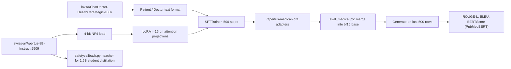

# ApretusHealthFindings — running, fine-tuning and distilling Apertus-8B for medical Q&A

Scripts around the **Apertus-8B-Instruct-2509** model by the Swiss AI Initiative: run it, chat with it, QLoRA-fine-tune it on a doctor/patient dataset, evaluate the result with ROUGE / BLEU / BERTScore, and prototype a teacher-student distillation loop with a custom optimizer and scheduler.

## What it does

| Script | Purpose |
|---|---|
| `run_apertus_8b.py` | Loads `swiss-ai/Apertus-8B-Instruct-2509` in bfloat16 with `device_map="auto"` and generates one sample answer (256 new tokens, temperature 0.8, top-p 0.9). |
| `chat_apertus_8b.py` | Terminal chat loop with conversation history using the model's chat template; `clear` resets, `exit` quits. |
| `train_medical.py` | QLoRA fine-tuning with TRL `SFTTrainer`: 4-bit NF4 quantisation (`BitsAndBytesConfig`), LoRA r=16 / alpha=32 on `q_proj,k_proj,v_proj,o_proj`, dataset `lavita/ChatDoctor-HealthCareMagic-100k` formatted as `Patient: ...\nDoctor: ...`, 500 steps, lr 2e-4 cosine, batch 4 x 4 accumulation, max length 512. Saves adapters to `./apertus-medical-lora`. |
| `eval_medical.py` | Merges the LoRA adapters into the 16-bit base model, generates answers for the last 500 rows of the dataset and reports ROUGE-L, BLEU and BERTScore (PubMedBERT), then opens an interactive prompt. |
| `safetycallback.py` | Distillation pipeline: 4-bit Apertus-8B as teacher, a freshly initialised ~1.5B student built from the Apertus config (hidden 2048, 16 layers, xIELU, QK-norm), KL-divergence + cross-entropy loss in `ApertusDistillationTrainer`, the `AdEMAMix` optimizer and a warmup-stable-decay scheduler, 5 steps on 100 WikiText-2 rows. Includes a monkey-patch for `bitsandbytes.Params4bit` and the `_is_hf_initialized` kwarg. |
| `test_toy_distillation.py` | Same distillation loop with `Qwen/Qwen2.5-0.5B` as a stand-in teacher and a 4-layer student, 50 steps, runs on CPU or a small GPU. |
| `patch_test.py`, `test_eval.py` | One-off checks for the bitsandbytes patch and the BERTScore/PubMedBERT tokenizer workaround. |

## How it works



## Getting started

```bash
pip install -r requirements.txt
python3 run_apertus_8b.py          # sample inference
python3 chat_apertus_8b.py         # interactive chat
python3 train_medical.py           # QLoRA fine-tune -> ./apertus-medical-lora
python3 eval_medical.py            # metrics + interactive test (needs the adapters)
python3 test_toy_distillation.py   # small distillation run
```

`requirements.txt` pins minimums: transformers>=4.44, torch>=2.4, accelerate, peft, trl, bitsandbytes, datasets, evaluate, rouge_score, bert_score, scikit-learn, sentencepiece.

## Model details (from the original notes)

- Model: `swiss-ai/Apertus-8B-Instruct-2509`, decoder-only transformer.
- Features: 1811 natively supported languages, 65k context length.
- Hardware: ~16 GB VRAM in full BF16, ~5 GB VRAM in 4-bit. The eval script comments assume a 40 GB GPU; the distillation script a 22 GB one.
- Memory: if you hit OOM in `run_apertus_8b.py`, load in 4-bit by adding `load_in_4bit=True` to `from_pretrained`.
- xIELU: the model uses a new activation function; a Python fallback is used if the CUDA-fused version is unavailable.

## Status and limitations

- No results are recorded in the repo: the evaluation prints metrics to stdout only, and no adapters or logs are committed.
- `MultilingualEvaluationCallback` and `SafetyAlignmentCallback` in the distillation scripts only print "checks passed" messages; they do not run any evaluation.
- The distillation runs are smoke tests (5 and 50 steps on WikiText-2 subsets), not real training.
- Several monkey-patches (`check_torch_load_is_safe`, tokenizer `model_max_length`, `Params4bit.__new__`) work around library-version mismatches and may break on other versions.
- No tests, no license file.
